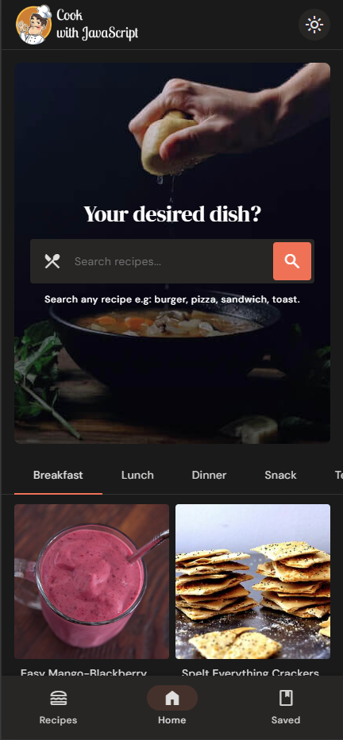

# Recipe App - Cook with JavaScript

A modern and responsive Recipe App built with vanilla JavaScript. This app allows users to explore a variety of recipes, save their favorites, and view detailed information about each recipe. The app features a light and dark theme for an enhanced user experience.

## Features

- **Responsive Design:** The app is fully responsive, providing a seamless experience on all devices.
- **Light and Dark Themes:** Users can switch between light and dark themes for comfortable viewing.
- **Recipe Page:** Explore a wide range of recipes with images, cooking time, ingredients, and more.
- **Saved Recipe Page:** Save your favorite recipes and access them easily in the saved recipes section.
- **Detail Page:** View detailed information about each recipe, including a step-by-step guide to preparation.

## Technology Stack

- **HTML5:** Markup language for creating the structure of the app.
- **CSS3:** Styling for responsive design and theme management.
- **JavaScript (ES6+):** Core logic of the app, including dynamic content rendering and user interactions.

## Screenshots

### Home Page

### Recipe Page

### Detail Page

### Saved Recipes Page

### Mobile View - Home Page

### Mobile View - Recipe Page

### Mobile View - Filter Bar

### Light Theme

### Dark Theme

## Usage

- Browse through various recipes on the homepage.
- Save your favorite recipes by clicking the save button on the detail page.
- Access saved recipes from the saved recipes section.
- Switch between light and dark themes using the theme toggle.

> **Note:** This project does not include a license. It is meant for educational and personal use only.
